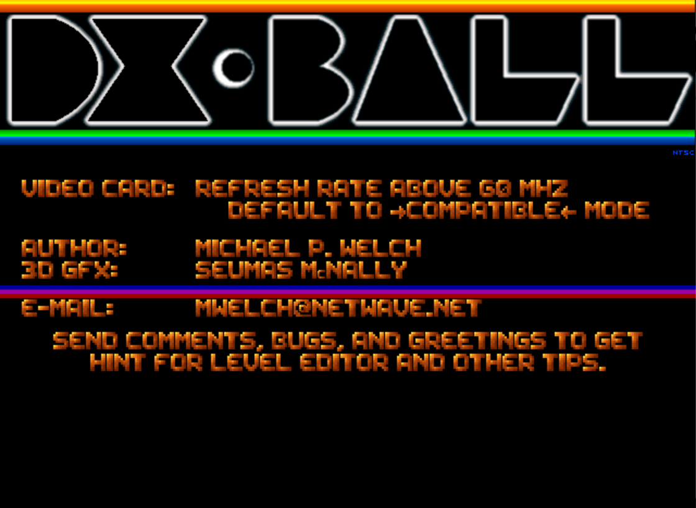
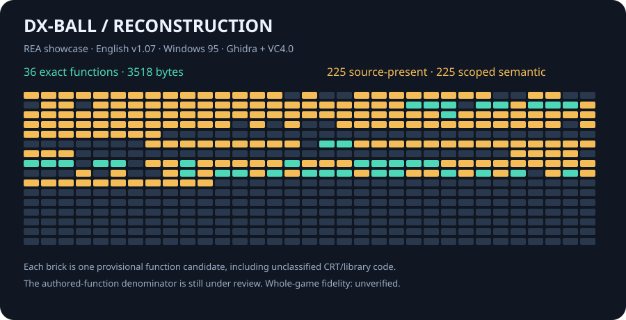

# DX-Ball

<p align="center">
  
</p>

<p align="center">
  
</p>

Source reconstruction of
**DX-Ball v1.07**, the 1996 Windows breakout game by
Michael P. Welch, with original 3D graphics by Seumas McNally.
Binary analysis uses [REA](https://github.com/morluto/rea) with its Ghidra
provider; original x86 execution and a pinned compiler check the recovered C.

> [!IMPORTANT]
> Core gameplay, lifecycle and frame drawing now join the board, resource and
> entity owners: **283 source-present functions** (270 authored bodies, one unknown-origin body and 12 runtime dependencies),
> **112,273 target differential cases**, and
> **116 byte-exact functions totaling 17,937 code bytes**, plus 136 separate metadata bytes. Windows builds now also produce
> experimental game EXEs. Wine controls cover ball motion, paddle input,
> pause/resume, editor persistence, a real round transition, natural life loss, ranking persistence and
> clean shutdown and complete original-board/menu campaigns in both maintained
> VC4 and MinGW builds; complete gameplay and
> driver fidelity remain in progress.

The [complete effect lifecycle batch](docs/EXACT_EFFECTS.md) restores four whole
animation creation, removal and stepping bodies, totaling 1,589 comparison
span bytes. It adds 1 complete exact functions and 259 code bytes;
all 115 previous complete identities survive. Existing cases and source-presence
counts stay fixed; the >=95% complete-source goal remains open.

The preceding [complete brick-power batch](docs/EXACT_BRICK_POWERS.md) restores whole brick
hits, explosive-neighbor conversion, special-brick softening and destructible
counting. Softening and counting add 546 complete exact bytes; hit and spread
remain full nonexact candidates. All 113 previous code and metadata identities
survive. Existing cases and source-presence counts stay fixed; the >=95% goal
remains open.

The preceding [complete bonus batch](docs/EXACT_BONUSES.md) restores the whole generation
and application switches and direct ball ignition. The 2,168-byte bonus updater
and 64-byte ignition match completely, adding 2,232 exact bytes. Generation
remains a full 1,197-byte candidate with 16 differences; projectile retirement
remains nonexact. All 111 preceding code and metadata identities survive.
Existing cases and source-presence counts stay fixed; the >=95% goal remains open.

The preceding [complete mode-frame batch](docs/EXACT_MODE_FRAMES.md) restores the 242-byte
menu frame and the full 1,688-byte enclosing gameplay frame. Menu matches all
242 bytes; gameplay remains a complete nonexact candidate. Original inline
explosion handling, two speed traversals, enlargement and genuine phase calls
replace factored helpers. All 110 prior exact identities survive. No cases or
source-presence entries are added; the >=95% complete-source goal remains open.

The preceding [complete splash batch](docs/EXACT_SPLASH.md) restores eight connected bodies /
3,029 original bytes. Initialization, frame, disposal and credits match all
1,242 bytes. Redraw, scroller wave, scroller update and palette pulse retain
23, 19, 3 and 17 complete differences. All 106 preceding code/metadata identities
survive one grouped cold epoch. Existing cases and source presence remain fixed;
the >=95% complete-source goal remains open.

The preceding [complete intro batch](docs/EXACT_INTRO.md) restores four controllers / 3,035
original bytes. Initialization and disposal match all 452 bytes; redraw and
point setup retain 560 and 750 complete differences. All 104 prior exact
code/metadata identities survive grouped cold replay. Existing cases remain
fixed, with direct music and resource-owner boundaries and the consumed local
binary point mask restored. The >=95% complete-source goal remains open.

The preceding [game setup/redraw/score batch](docs/EXACT_RUNTIME_SETUP.md) restores three
complete controllers / 1,438 original bytes. Initialize and redraw match all
1,005 bytes; score retains 76 complete differences in its 433-byte body.
All 102 prior exact code/metadata identities survive the grouped cold epoch.
The unsigned conversion boundary also gains whole-object runtime-origin proof.
Existing cases and source presence stay fixed; the >=95% source goal stays open.

The preceding [round lifecycle batch](docs/EXACT_LIFECYCLE.md) restored four complete
controllers / 911 original bytes. Finish, restart and dispose match all 485
bytes; reset retains 20 bank-address scheduling differences in its full
426-byte body. All 99 preceding exact code/metadata identities survive one
grouped cold compilation. Existing owner cases, full COFF vectors and both
Windows builds pass without new matrices. The >=95% complete-source goal
remains open.

The preceding [rectangle and fire-effect batch](docs/EXACT_CONNECTED_EFFECTS.md) restored
four complete bodies / 1,071 original bytes. Three match all 645 bytes; the
same cold compilation naturally recovers two existing candidates / 330 bytes.
Seven prior exact emissions lose acceptance / 2,049 bytes after shared source
changes; all 94 surviving code and metadata identities remain unchanged.
Existing owner cases and Windows builds pass. The >=95% complete-source goal
remains open.

At the previous checkpoint, The [ball and projectile controller batch](docs/EXACT_CORE_CONTROLLERS.md)
restores three complete bodies / 3,872 original bytes and accepts the full
321-byte projectile fire function. Ball/projectile updates retain 23/8
frame-displacement differences with all real calls and relocations restored.
All 100 preceding exact units survive grouped cold replay. Existing cases
pass through a test-only native sound/RNG bridge; no cases or campaign are added.
The >=95% complete-source goal remains open.

The [bank loops and palette state batch](docs/EXACT_BANK_LOOPS.md) accepts
three complete functions, adding 462 exact code bytes. It also restores five
complete palette/COM candidates totaling 2,080 bytes with their remaining
differences recorded. All 97 preceding exact units survive grouped cold replay;
existing validation passes without new cases. The >=95% complete-source goal
remains open.

The [complete exits and text/palette batch](docs/EXACT_EXITS.md) restores
eleven complete functions, adding 641 exact code bytes. It recovers ordinary
exit branches, the consumed text-width local and the palette guard's early
return. All 86 preceding units remain exact in grouped cold replay; existing
validation runs as one batch without additional cases.

The [integer trig and hit-region batch](docs/EXACT_INTEGER_TRIG.md) restores
five complete functions, adding 365 exact code bytes. Raw table lookups and
wave helpers reuse their observed parameters; region stores retain repeated
indexed addressing. All 81 prior units remain exact. Existing validation is
replayed as a batch without new cases; the >=95% complete-source goal stays open.

The [score and raster control-flow batch](docs/EXACT_CONTROL_FLOW.md) restores
the complete 74-byte score update. Explicit raster clamp branches reduce the
full triangle comparison from 235 to 99 frame-displacement differences. All 80
previous units remain exact; source presence and distinct-case counts stay
unchanged. The authored denominator and >=95% complete-source goal remain open.

The [projection and text exact batch](docs/EXACT_PROJECTIONS_TEXT.md) restores
three complete projection helpers and the text traversal helper, adding 852
exact code bytes. All 76 prior units remain exact in a grouped cold replay;
source presence and distinct-case counts stay unchanged. The authored-function
denominator and >=95% complete-source objective remain open.

DX-Ball serves as a working REA showcase: inspect a function, follow its callers
and state, recover maintainable source, then replay independent oracles.
The [core exact batch](docs/EXACT_CORE.md) restores the original trig-table
computation, lookup storage and current-sprite read in ball construction. Four
more complete functions match the pinned original after every relocation, adding
736 exact bytes without new fixtures or another campaign.
The [cloning and cleanup batch](docs/EXACT_LISTS.md) restores the complete
637-byte ball clone and five missing typed cleanup entries, adding another
877 exact bytes and five source mappings. Direct-case counts stay unchanged.
The [palette exact batch](docs/EXACT_PALETTES.md) restores two inline RGB-tail
loaders and the missing palette creation/attachment entry. Three complete
emissions add 1,020 bytes and one source mapping using the evidenced VC4
single-threaded stdio model. The surface constructor's active use remains open.
The [display exact batch](docs/EXACT_DISPLAY.md) restores four missing sprite
blit/rectangle-queue entries and the complete BltFast bodies, plus the ordinary
resource blit. Seven emissions add 2,219 exact bytes without new tracked cases.
For example, the [software rotation investigation](docs/ROTATION_INVESTIGATION.md)
uses saved REA instructions to recover an omitted angle argument, an asymmetric
pixel write and precise floating-point stores. The shared C passes 1,024
original-x86 cases; executing its actual VC4 output verifies the same complete
buffers and calls, and the 40-byte wrapper matches exactly. These results cover
controlled surfaces; direct gameplay use remains unestablished. See the
[gameplay investigation](docs/GAMEPLAY_OWNER.md) for the connected sound-pan example.
The [raster-controller investigation](docs/RASTER_INVESTIGATION.md) uses REA's
exact instruction view to distinguish a shared cdecl return from an inferred
stdcall signature, and follows fixed-point division into Win32 `MulDiv`.
The shared triangle, polygon and span owner passes 7,164 original/native cases;
its actual VC4 output passes the same full pixel and scratch vectors. Compiler
corroboration is counted once, and raster byte-exactness remains open.
The [bitmap-loader investigation](docs/BITMAP_INVESTIGATION.md) follows saved
REA instructions through short reads, row traversal and palette creation. Its
shared C preserves unwritten palette flags under controlled caller-stack
fixtures; native and actual VC4 execution agree on 975 complete cases. Real
DirectDraw delivery and active gameplay use remain open.
The [power-up investigation](docs/POWERUPS_OWNER.md) follows the bonus updater
through board effects and paddle rebounds, recovering the game's computed
trigonometry tables and checking its rounding against original execution.
The [core gameplay investigation](docs/CORE_OWNER.md) connects the main ball
updater to the full frame, testing collisions, shot damage and deferred powers
over 200 continuous frames. The [queue investigation](docs/CORE_QUEUES.md) uses
REA instructions to recover the full integer returns and cursor effects of
projectile/fire-effect helpers, checked in 590 direct cases and 64 separate
connected calls. The [runtime investigation](docs/RUNTIME_OWNER.md)
follows the frame caller into initialization, paddle animation and life-loss
reset, checking 36 further connected frames through game-over dispatch. REA's
caller evidence distinguished the actual gameplay initializer from an intro
point-table routine. The [frame drawing investigation](docs/DISPLAY_OWNER.md)
connects last-brick lightning, dirty-region restoration and rectangle merging;
192 additional continuous frames execute all twelve maintained gameplay phases.
The [device recovery investigation](docs/DEVICE_OWNER.md) connects palette fades
and lost-surface recovery to real initialization, frame dispatch and redraw.
Following the shared bank layout also corrected two duplicated state fields.
The [Windows startup investigation](docs/PLATFORM_OWNER.md) follows WinMain
and the window procedure through device creation and game input, checking
4,742 original-x86 cases including startup failures and stdcall cleanup.
The [working-resource and UI investigation](docs/STARTUP_UI_OWNER.md) continues
into startup configuration, score files and vertical-blank timing, then recovers
text placement, original line pixels and palette operations in 1,424 cases.
The [menu and splash investigation](docs/INTRO_OWNER.md) reuses saved REA
dossiers to connect the opening scroller, point animation, text and palettes
to real mode dispatch, with 5,615 direct cases and 58 separate transition checks.
The [game-over investigation](docs/GAMEOVER_OWNER.md) follows name input and
persisted ranking insertion, checking original tie ordering, text placement,
ranking line pixels and score-file failures in 6,531 direct cases and 76 separate transitions back to menu.
The [editor investigation](docs/EDITOR_OWNER.md) connects toolbar selection,
CTRL painting and board persistence to actual mode/key/window routing in 2,921
direct cases and 32 separate transitions. REA confirms empty F-key branches
and the original store-before-switch behavior. All five mode controllers now
default to maintained source. The [MDS music investigation](docs/MIDI_OWNER.md)
follows the loader through compact-event expansion and stream callbacks. REA's
instruction view corrects two return codes and an incomplete callback prototype;
2,109 direct cases and 134 separate lifecycle checks cover all six original
songs. The [sound investigation](docs/SOUND_OWNER.md) connects DirectSound
startup, WAV upload, focus recovery and [persistent sound parameters](docs/SOUND_CONTROLS.md).
REA exposes the reload-and-retry behavior after a lost buffer and the cached
parameter writes even when a setter fails. The sound suite has 5,782 direct
cases and 48 separate lifecycle checks across all 26 sound assets. The [Windows adapter](docs/WINDOWS_ADAPTER.md)
uses those recovered contracts to bind real Win32, DirectDraw, DirectSound and
WinMM calls. Original/VC4/MinGW control runs exercise ball release/motion,
pause/resume, mouse input, complete editor bank save/reload and natural
game-over/name/ranking persistence under Wine, including a fresh process readback.
Read-only state observations distinguish a completed transition from a screen
that is still fading. A [round control](docs/ROUND_FOCUS_RUNTIME.md) clears an
editor-created board and verifies the next original board in all three builds;
REA process capture retains the run and its limits. The original focus control
stalls under Wine/Xvfb; an independent SDK probe corroborates a lost-surface
status-reporting gap, while successful game recovery remains open. Physical audio and
complete-game fidelity remain unverified.
The [embedded resource investigation](docs/EMBEDDED_RESOURCES.md) follows REA's
resource bytes into private VC4/MinGW builds, then checks the complete inventory
and decoded icon through an independent SDK probe. It preserves the original
startup's mismatched icon identifier and compares a resource-free control.
The [original-board integration](docs/ORIGINAL_CAMPAIGN.md) adds a persistent
read-only SDK observer and ordinary mouse controls, with bounded state reports
and REA process Evidence. The full original-only control now verifies all 50
unchanged initial boards and the completed return to menu in about 91 minutes.
The maintained VC4 build also passes all 50 initial boards and returns to menu
in about 85 minutes. Its REA capture binds the final SDK report; the MinGW full
campaign and synchronized trajectory/pixel fidelity remain unverified.
The [contact policy](docs/CONTACT_POLICY.md) follows the recovered discrete
wall/collision contracts, with 1,464 controlled fixtures and 21,168 compared
frames. Its five-board episode compares another 16,756 original/native frames.
These differential episodes remain separate from full reconstructed campaigns.

The [allocation investigation](docs/ALLOCATOR_OWNER.md) follows REA instructions
through new/delete, malloc mode, handler retries and heap initialization. Its
shared C now supplies the game owners' allocation defaults. Native C and actual
VC4/MinGW objects agree over 1,437 original calls; separate SDK probes confirm
physical heap ownership through the Windows adapter under Wine. Public connected
frame and terminal controls exercise 564 complete frames and 12 allocation
failure exits, with fresh-process replay; see the investigation for commands
and controlled API limits. Byte exactness and complete CRT startup remain
separate obligations.

The [termination investigation](docs/TERMINATION_OWNER.md) follows allocation
failure into the original CRT callback dispatcher. Four standalone runtime
functions pass 1,031 original/native cases and actual VC4/MinGW object replay,
including callback mutations and full-width exit arguments. The experimental
game still uses its host CRT; physical termination and registration remain open.
The [runtime-library investigation](docs/CRT_PROVENANCE.md) pairs REA instruction
and byte observations with whole pinned CRT objects, identifying eight further
runtime dependencies. Library provenance stays separate from maintained source
and exact reconstruction progress.
We build on the evidence and
replay discipline of [th095](https://github.com/N0zoM1z0/th095), adapted to
DX-Ball's DirectX interfaces, C owners, board formats and compiler evidence.

## Supported target

| Property | Value |
| --- | --- |
| Game | DX-Ball v1.07, English |
| Original release in included README | October 31, 1996 |
| Executable | `DXBALL.EXE`, 158,208 bytes |
| SHA-256 | `756da1ba09edce716d5bf8770320ca0d5ed4e525672b6bb605b9bdb4b88972ba` |
| Platform | Windows i386, DirectDraw / DirectSound / WinMM |
| Image base / entry | `0x00400000` / `0x004187A0` |
| PE linker | 3.00 |
| Compiler candidate | VC4.0, compiler 10.00.5270 / linker 3.00.5270 |

The original game, data, archives, toolchain binaries, and Ghidra database are
private local inputs and are not included. The supplied title screenshot above
illustrates the original game. Supply the exact archive identified
in [target.toml](config/target.toml); another DX-Ball version cannot substitute
for this target.

## Get the original game

Download **`DX_Ball_Win_Preinstalled_EN.zip`** from the
[DX-Ball download page on Old Games Download](https://oldgamesdownload.com/game/dx-ball-m3r/).
The [English game README](https://oldgamesdownload.com/readme/dx-ball-windows-readme-english/)
identifies v1.07 and documents the original game. The README page contains the
manual; use the game page for the ZIP.

Keep the downloaded archive unchanged. Its expected SHA-256 is:

```text
e6c8a8d2b55e3d3bd5908b8febaab82493b2fb3e154877143f1266731a007cbb
```

The import command below verifies the archive, extracts local inputs into
ignored `original/`, and verifies the executable and asset manifest. A matching
archive plus the pinned tools lets readers replay every currently accepted
reconstruction checkpoint from this public repository. The complete playable
game remains work in progress.

## Local setup

The analysis workflow currently targets Linux x86-64 with Python 3.11+, Git,
Wine with win32 support, Xvfb, CMake, Ninja, GCC, MinGW i686, and
Node.js 22.19 with npm for the pinned REA runtime. Use
`scripts/repo-python` for all repository Python commands: it selects an
interpreter only after checking actual package and native-library hashes.

```bash
git clone https://github.com/N0zoM1z0/dx-ball.git
cd dx-ball
scripts/bootstrap-python.sh
scripts/repo-python scripts/bootstrap-tools.py
scripts/repo-python scripts/import-target.py /path/to/DX_Ball_Win_Preinstalled_EN.zip
scripts/repo-python scripts/verify-target.py
scripts/repo-python scripts/verify-toolchain.py --execute
scripts/repo-python scripts/bootstrap-rea.py
scripts/rea doctor --provider ghidra --json
```

For an existing local tool root, reuse its pinned JDK installation:

```bash
scripts/repo-python scripts/bootstrap-tools.py --reference-tools /path/to/th095/.tools
```

Version, archive, compiler-component, header/library, interpreter-package, and
native-engine identities are recorded in [tools.lock.toml](config/tools.lock.toml).
Compiler execution uses this repository's own ignored Wine prefix.
Builds run one job at a time. On Linux, project build and REA entry points keep
child processes on one allowed CPU; Ghidra's maximum Java heap is 512 MiB.
These resource limits keep the workflow modest and can make analysis slower.

REA and its npm dependencies are pinned in `config/rea/package-lock.json`;
`config/rea.lock.json` binds the installed runtime and Ghidra provider. Use
`scripts/rea` for project analysis. See [REA setup and showcase](docs/REA.md)
for MCP registration, evidence snapshots and the verified DX-Ball example.

## Build and verify

```bash
# Public portable source and ledger checks; no original game required.
scripts/repo-python scripts/ci.py --public

# Complete private suite: target/Ghidra attestation, cold exact replay,
# rejection tests, original-x86 differential tests, and real Windows runs.
scripts/repo-python scripts/ci.py

# Inspect one original board (1..50) as JSON.
build/native/dxball_boards original/DEFAULT.BDS 1
```

The shared C owner builds natively, with MinGW i386, and with the pinned VC4.0
compiler/linker. The native utility checks all 50 boards; both Windows utilities
run boards 1, 25, and 50 under Wine and reproduce the same JSON output.
The resource inspector decodes all seven supplied SBK banks and five PCX files;
native, MinGW and VC4.0 products reproduce identical metadata and pixel hashes.

```bash
scripts/repo-python scripts/replay-exact-units.py
scripts/repo-python tests/test_exact_oracle.py
scripts/repo-python tests/test_boards_differential.py
scripts/repo-python tests/test_resources_differential.py
scripts/repo-python tests/test_rotation_differential.py
scripts/repo-python tests/test_rotation_coff.py
scripts/repo-python tests/test_gameplay_differential.py
scripts/repo-python tests/test_effects_differential.py
scripts/repo-python tests/test_entities_differential.py
scripts/repo-python tests/test_powerups_differential.py
scripts/repo-python tests/test_core_differential.py
scripts/repo-python tests/test_runtime_differential.py
scripts/repo-python tests/test_display_differential.py
scripts/repo-python tests/test_device_differential.py
scripts/repo-python tests/test_platform_differential.py
scripts/repo-python tests/test_startup_differential.py
scripts/repo-python tests/test_ui_differential.py
scripts/repo-python tests/test_intro_differential.py
scripts/repo-python tests/test_gameover_differential.py
scripts/repo-python tests/test_editor_differential.py
scripts/repo-python tests/test_midi_differential.py
scripts/repo-python tests/test_sound_differential.py
scripts/repo-python tests/test_windows_abi.py
scripts/repo-python tests/test_windows_resources.py
scripts/repo-python tests/test_windows_runtime.py
scripts/repo-python tests/test_windows_play.py
scripts/repo-python tests/test_windows_gameover.py
scripts/repo-python scripts/report-reconstruction-status.py --summary
```

Exact replay compares complete function sections with every reviewed relocation
applied and referenced strings verified. It never masks differing bytes. The
semantic oracle executes the original x86 functions and compares maintained C
state and ordered dependency calls. Resource tests also compare decoded pixel
buffers; particle tests compare actual 2x2 writes to controlled 8-bit surfaces.
Drawing traces do not establish DirectDraw backend equivalence. Public GitHub
Actions runs portable builds, strict i686 Windows compilation and ledger
validation; private-target oracles run locally.

Windows game builds are `build/vc40/dxball.exe` and
`build/windows-i686/dxball.exe` (the latter needs its neighboring
`libdxball_core.dll`). After the private build, prepare a working data copy with:

```bash
scripts/repo-python scripts/run-windows.py --profile vc40 --prepare-only
# Or launch that copy through Wine on a suitable display:
scripts/repo-python scripts/run-windows.py --profile vc40
```

Default Windows builds extract the two embedded resources from the verified
original and link them into the game EXE. Public source and SDK compilation can
run without originals or the private legacy toolchain using
`scripts/repo-python scripts/build-windows.py --without-game-resources`;
that explicit mode omits original resources. See the
[resource evidence and build notes](docs/EMBEDDED_RESOURCES.md).

The helper verifies all original asset hashes and keeps score/editor writes in
`build/runtime/vc40/`; later manual runs preserve those saves. The optional real
runtime probe also needs `xdotool` and ImageMagick. It runs original, VC4 and
MinGW control copies sequentially on a 640×480 8-bit Xvfb display, records actual
screenshots and checks zero-code shutdown. This environment shows palette
artifacts in the original too; it does not establish physical display/audio
quality. See the [adapter notes](docs/WINDOWS_ADAPTER.md) for observed coverage.

`tests/test_windows_play.py` also checks real ball/paddle/pause controls and
editor paint/save/reload/return. Its observer reads process state without hooks
or target writes; all three runs persist the same complete 20,000-byte board
bank in resettable copies. The original 49 files retain their verified hashes.

The [terminal control](docs/TERMINAL_RUNTIME.md) uses REA process
capture to follow 50 real clears of editor-created boards. Returning to the
menu and the scoped terminal storage pattern agree in all three builds. REA's
loader and CRT evidence guided one shared storage object and overlap-safe copies;
459 additional x86 integration cases check every stored byte, including nonzero
unknown state. Five changed compiler emissions retain semantic validation and
are [explicitly demoted from exactness](docs/BUILD_MATCHING.md). Completion of
the original campaign is now verified by the separate original-only control;
full reconstructed campaigns remain unverified.

`tests/test_windows_gameover.py` uses ordinary mouse input to miss balls until
three lives are exhausted, then enters and edits a name through actual keys.
It checks every byte of the 660-byte ranking file and the in-memory table,
including readback after restarting the game. Each run derives its expected
ranking from its own earned score; random trajectories need not coincide.

To follow the sound-pan investigation with REA after setup:

```bash
scripts/rea function original/DXBALL.EXE 0x00406400 --provider ghidra \
  --snapshot .analysis/rea/dxball.snapshot.json --json
scripts/repo-python scripts/replay-exact-units.py --unit screen-pan
scripts/repo-python tests/test_gameplay_differential.py
```

The [REA workflow](docs/REA.md) explains retained Evidence and snapshots; the
[gameplay owner](docs/GAMEPLAY_OWNER.md) connects the returned instructions to
source, original behavior and acceptance limits.

## Reconstruction notes

- [Current handoff](docs/RE_HANDOFF.md), [architecture](docs/ARCHITECTURE.md),
  [workflow](docs/RE_WORKFLOW.md), and [knowledge base](docs/KNOWLEDGE_BASE.md).
- [Exact compiler evidence](docs/BUILD_MATCHING.md),
  [oracle matrix and limits](docs/ORACLES.md), and [progress](docs/PROGRESS.md).
- [Resource ownership and file formats](docs/RESOURCE_OWNER.md).
- [Software sprite rotation and compiled floating-point behavior](docs/ROTATION_INVESTIGATION.md).
- [Brick-hit gameplay, explosions and sound pan](docs/GAMEPLAY_OWNER.md).
- [Explosion queues and brick animations](docs/EFFECTS_OWNER.md).
- [Particle updates, pixel writes and bonus production](docs/ENTITIES_OWNER.md).
- [Core ball physics and gameplay frame](docs/CORE_OWNER.md).
- [Game initialization, life-loss reset and mode routing](docs/RUNTIME_OWNER.md).
- [Lightning, dirty-region merging and frame presentation](docs/DISPLAY_OWNER.md).
- [Device recovery and palette fades](docs/DEVICE_OWNER.md).
- [Windows startup and input](docs/PLATFORM_OWNER.md).
- [Working-resource setup and shared UI](docs/STARTUP_UI_OWNER.md).
- [Menu, splash, scroller and point animation](docs/INTRO_OWNER.md).
- [Game-over, name entry and persisted high scores](docs/GAMEOVER_OWNER.md).
- [Editor controllers, toolbar hit regions and board persistence](docs/EDITOR_OWNER.md).
- [MDS parsing, MIDI stream control and music lifecycle](docs/MIDI_OWNER.md).
- [DirectSound lifecycle, WAV loading and lost-buffer recovery](docs/SOUND_OWNER.md).
- [Windows adapter ABI checks and integration](docs/WINDOWS_ADAPTER.md).
- [REA analysis workflow and showcase](docs/REA.md).
- `config/functions.csv`: 528 provisional candidates; boundaries and runtime
  origins still require review.
- `config/implemented.csv`, `semantic-acceptance.csv`, and `matches.csv`:
  independent source, scoped semantic, and complete byte-exact facts.

Upcoming work includes the Windows adapter, real DirectSound/WinMM/DirectDraw
delivery and complete EXE integration. Names and ownership
are promoted only with target-local evidence.

## License and attribution

The maintained reconstruction source and repository tooling are available under
the [MIT license](LICENSE). Original DX-Ball code, game artwork, audio, data, and
third-party toolchains retain their respective rights. The title screenshot is
included for illustration; original game binaries and asset files are not included.
The progress illustration is generated from reconstruction ledgers.
