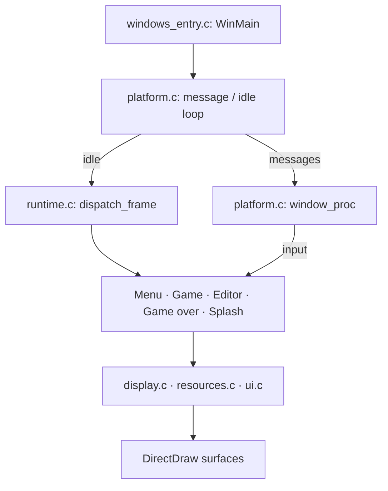

# How the game fits together

Start with [the Windows loop](../src/platform.c), then follow
[mode dispatch](../src/runtime.c) into [the gameplay frame](../src/core.c).
The [source map](../src/README.md) lists the supporting modules.

## Entry and mode dispatch

[WinMain](../src/windows_entry.c) binds Windows services, initializes the
runtime heap, and enters `dxball_win_main`. The loop processes window messages
when they are available and calls `dxball_dispatch_frame` while the game is
active and idle. The window procedure records mouse state and routes keys to
the current mode.

The mode table in `runtime.c` supplies initialization, redraw, frame, and
cleanup functions. Device-reset handling runs before the selected frame;
a requested mode change cleans up the old mode and initializes the next.

| Mode | Frame and screen code |
| --- | --- |
| 0 — Menu | [intro.c](../src/intro.c), including the point animation |
| 1 — Game | [core.c](../src/core.c); lifecycle and score code in [runtime.c](../src/runtime.c) |
| 2 — Editor | [editor.c](../src/editor.c) |
| 3 — Game over | [gameover.c](../src/gameover.c), including name entry and rankings |
| 4 — Splash | [intro.c](../src/intro.c), including credits and the scroller |

## An unpaused gameplay frame

`dxball_game_frame` connects the smaller owners in this order:

1. Refresh the score and update the paddle, balls, projectiles, bonuses, and particles.
2. Restore dirty regions, advance brick and fire effects, and draw the moving objects.
3. Present the display when using a back buffer and advance the palette animation.
4. Consume explosion requests and bonus flags, handle level/life transitions, and process launch or firing input.

[gameplay.c](../src/gameplay.c) owns brick-hit rules and explosion requests.
[effects.c](../src/effects.c) advances brick/explosion animations;
[bonuses.c](../src/bonuses.c) and [particles.c](../src/particles.c) own their
respective entities. [balls.c](../src/balls.c) handles ball creation, cloning,
and rebound helpers, while `core.c` handles movement and collisions.
[round.c](../src/round.c) connects board initialization to level progression.

## State and rendering

The game shares globals through module headers. Typed linked lists hold balls,
projectiles, effects, bonuses, and particles; [list_initializers.cpp](../src/list_initializers.cpp)
defines their canonical global owners and constructors.
[board_storage.h](../src/board_storage.h) keeps the board bank, palette clock,
explosion owner, ball count, and working tiles in one storage object.
[boards.c](../src/boards.c) loads the 50-board bank and draws its 20×20 tile grids.

[resources.c](../src/resources.c) loads sprite banks and PCX images, selects
sprite/font banks, and draws through the DirectDraw declarations in
[resources.h](../src/resources.h). [display.c](../src/display.c) tracks dirty
regions, restores backgrounds, and presents by flipping or copying regions.
[device.c](../src/device.c) handles palette fades and surface recovery;
[ui.c](../src/ui.c) builds text and line drawing on those services.
[rotation.c](../src/rotation.c), [raster.cpp](../src/raster.cpp), and
[bitmap.c](../src/bitmap.c) contain the separate software drawing and image helpers.

## Platform boundaries

[windows_adapter.c](../src/windows_adapter.c) binds Win32, DirectDraw,
DirectSound, and WinMM services. [sound.c](../src/sound.c) manages sound buffers;
[midi.c](../src/midi.c) parses and streams music;
[music.cpp](../src/music.cpp) owns song loading and playback controls.
[file.c](../src/file.c) owns the shared file services and binary loader used
by sound and MDS. Typed service pointers and the `*Ops`/`*Api` tables let host tools supply
controlled dependencies.

[CMakeLists.txt](../CMakeLists.txt) builds the shared `dxball_core` library,
two asset inspectors, and the Windows game entry point. Game values retain
32-bit widths; host pointers and surface handles follow the host ABI.
[allocator_host.c](../src/allocator_host.c) supplies host allocation callbacks,
and [runtime_text_host.c](../src/runtime_text_host.c) supplies the Unix score-text
conversion. The Windows entry replaces the heap callbacks with Win32 services.
